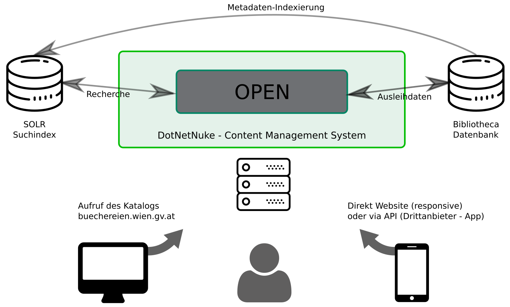

### Systemarchitektur OPEN

### Neuerungen
* Zeitgemäße Web-Technologie (Neuer Server, neue Software)
  * Responsives Design des Online-Kataloges
  * OPEN läuft in einem Open-Source CMS und kann somit eingeschränkt selbständig ergänzt werden.
  * Erlaubt Integration von externen Inhalten
* Bessere Integration Inhalte von Drittanbietern:
  * Verfügbarkeitsanzeige bei E-Medien der Onleihe (theoretisch)
  * Cover-Abbildungen

### Neuerungen - Suche

* Suche in Solr-Index anstatt direkt in der Datenbank
  * Autovervollständigung während der Suchbegriffseingabe
  * Facettierung und Filterung der Suchergebnisse
  * „Meinten Sie“-Vorschlag
  * Suche schneller als in relationaler Datenbank
* Features für BenutzerInnen:
  * Medienmerkliste, Suchen speicherbar
  * Direkte Vormerkung am spezifischen Exemplar

### Bekannte Probleme

* Erweiterte Suche: Systematik/IKA (deaktiviert)
  * Workaround über Systematiklink [buechereien.wien.gv.at/Mediensuche/Einfache-Suche?query=SC|SystematicLink|AND|2|Notation](https://buechereien.wien.gv.at/Mediensuche/Einfache-Suche?query=SC%7cSystematicLink%7cAnd%7c2%7cPL.MU) und Facettenfilter:
* Suche nach U-Sätzen in MBW:
  * Briefmarkenbeispiel: Michel Übersee - Bd. 9.2 Japan
  * Workaround auf [QM](https://openm13.wien.gv.at) implementiert (MBW-Titel wird als Reihentitel indexiert)
* Anmeldung auf Startseite - "kein Respond"
* Schlagwortfolgen: Verweisformen werden angezeigt

### Geplante Korrekturen

* Systematik-Register
* Verlinkung der Standort-Angaben
* Sprachen-Facette (Datenbereinigung)
* Sys-/IKA-Facette (aufwändige Datenbereinigung nötig)

### Error Reporting

* [Buchwiki SoftwareTracking](https://www.intern.magwien.gv.at/buchwiki/user/bin/view/Tasks/SoWaTHome?Software=Teststellung%20Open&Version=7.0&Alle=ja)
* [GitHub](https://github.com/bucwien)
